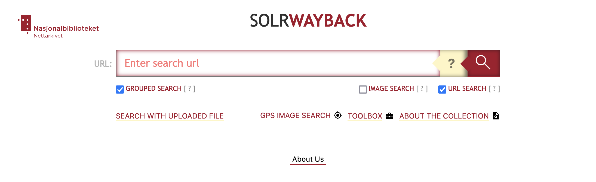
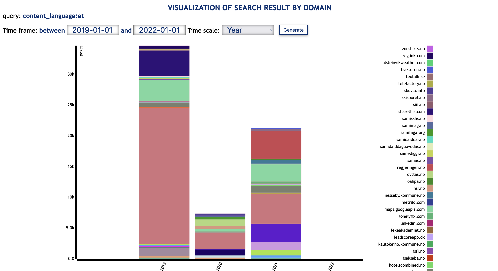
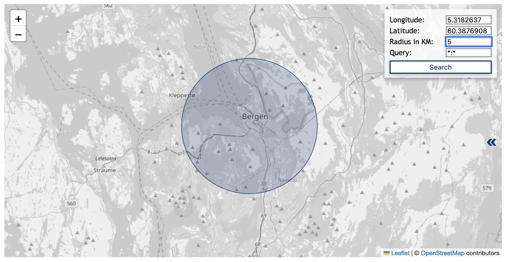

# Search modes

SolrWayback have some different modes for search:

- [Text search](#text-search) (default)
- [Grouped search](#grouped-search)
- [Image search](#image-search)
- [Url search](#url-search)
- [GPS Image Search](./gpsimage.md)
- [Search with uploaded file](#search-with-uploaded-file)

## Text search
This is the default mode. For more information about to use it, see [Search synthax](./search-synthax.md) and [Field descriptions](./fields).

## Grouped search
This mode will group the results by URL. If several hits have the same URL (different versions of a document), only the most recent version will be presented in your result.

To activate this mode, check the "Grouped search" box below the search bar.

## Image search
In principle, this mode allow image search in the context of text. The service will result images that appear in HTML pages that matches the search word/phrase.

To activate this mode, check the "Image search" box below the search bar.

## URL search
Nice to have if you are searching for a specific URL. This mode encodes the domain name and normalise the URL, searching for different representations of the URL.

To activate this mode, check the "URL search" box below the search bar.

## GPS Image Search

GPS Image Search allow you to search for images, based on a geographical scope. It will only return images containing exif metadata about its location.

Because of the time used to fetch the images, the represented results are limited to 500. [^1]

### Defining geographical scope
The most intuitive way to define the geographical scope is to interact with the map:
- Zoom in/out can be done by pinching/spreading two fingers on your touchpad, or by click the `+` or `-` icons.
- Clicking in the map with your mouse pointer will define the center of your circumference.

You can also define the scope of your GPS image search by adding coordinate values for latitude and longitude. Full stop/period (`.`) is used as decimal separator.

### Adding query to geo-based image search
To further scope your search geobased image search, you can add a query.

This is done by entering the desired field and value in the query field on the format `{field}:{value}`. E.g. `domain:blogg.no`

### 

This 

## Search with uploaded file

----
[^1]: It is possible to get a report of all images that matches your scope, without fetching and displaying the images. This will allow you to make a list of all images matching your query, without the limit of 500 results.

This is done by performing a service call to a certain URL: `https://nettarkivet.beta.nb.no/solrwayback/services/frontend/images/search/location/?query=*:*&latitude=56.17&longitude=10.20&d=50`.

Change the parameter values for query, latitude, longitude and d (diameter in kilometers) as preferred.